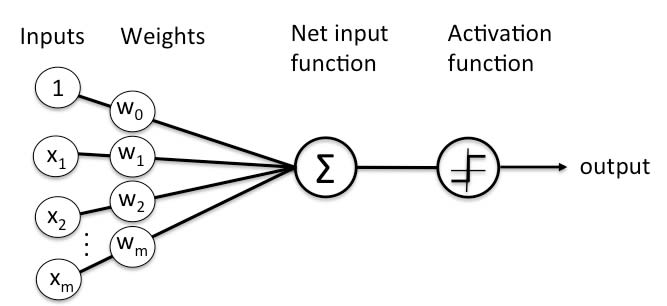

# Algorithms

## Objectives: 

Implementation of various Algorithms in Java. 

## Tree Traversal Algorithms:

These are search algorithms used in traversing tree-type structures.

* [Breath first][1.1]: Starting at a specific node, explore all the leaf nodes at the present depth prior to moving on to the vertices at the next depth level.
* [Depth first][1.2]: Starting at a specific node, explore as far (deep) as possible along each branch before backtracking.
* [Iterative deepening depth first][1.3]: A depth-limited version of *Depth First* that runs repeatedly with increasing depth limits until the goal is found. *Breath First* is performed at each level. 
* [A-Star][1.4]: Find shortest path from a specified starting point to a specified destination, by finding a path that minimizes f(x) = g(x) + h(x)

[1.1]: https://en.wikipedia.org/wiki/Breadth-first_search
[1.2]: https://en.wikipedia.org/wiki/Depth-first_search
[1.3]: https://en.wikipedia.org/wiki/Iterative_deepening_depth-first_search
[1.4]: https://en.wikipedia.org/wiki/A*_search_algorithm

## Search Algorithms:

These are search algorithms that are used in searching liner-type functions. 

* [Bruce force][2.1] (Iterative): Systematically enumerates through all specified intervals on a range. For example, to find the maximum result of a function within a given start and end boundary for x, given a specific interval, each point is evaluated (this will find the **global** optimum).
* [Stochastic][2.2] (Metaheuristic): Similar to *Brute Force*, but instead it iterating through all intervals on the range, random points in the range are evaluated for a given number of iterations. The higher the number of iterations, the higher the probability of finding either the **local** or **global** optimum).
* [Hill climbing][2.3] (Iterative): Similar to *Brute Force*, but instead of going through all intervals on the range, it stops once the **local** optimum is found. This may not however be the **global** optimum.
* [Tabu][2.4] (Metaheuristic): Evaluates all adjacent options and choose the best one. Once an option has been chosen it's put into the front of the "Tabu" list (FIFO) for a period to prevent it from being re-selected. Unlike hill climbing search, worsening options can be accepted if no improving options is available (provided the option is not in the tabu list). 
* [Simulated annealing][2.5] (Metaheuristic): Similar to *Stochastic* in that it also uses random intervals on the range. Though unlike *Stochastic*, a worse result can be accepted depending on some probability based on a reducing "temperature".

Note: Metaheuristics sample a set of solutions which is too large to be completely sampled. Metaheuristics do not guarantee that a globally optimal solution, but do supply a sufficiently good solution. 

[2.1]: https://en.wikipedia.org/wiki/Brute-force_search
[2.2]: https://en.wikipedia.org/wiki/Stochastic_optimization
[2.3]: https://en.wikipedia.org/wiki/Hill_climbing
[2.4]: https://en.wikipedia.org/wiki/Tabu_search
[2.5]: https://en.wikipedia.org/wiki/Simulated_annealing

## Genetic Algorithm

A simple implementation of a genetic algorithm, to match a pre-defined sequence of values, using a random population using cross-overs and mutations of individuals within that population.

Essentially the steps followed are as followed:

1) Define a target solution, for example a sequence of 5 numbers ... {1, 2, 3, 4, 5}. 
2) Generate a population of random individuals, each with a random sequence of numbers (if the target sequence has 5 numbers, then the individuals random sequence will have 5 numbers). 
3) Establish the fitness of each individual. This is calculated by establishing how many values match between the individuals sequence and the target sequence (in the same position).
4) Create a new population by running two "tournaments" between a random subset of the original population and "breed" the winners of the two tournaments, adding the offspring to the new population (based on cross over rate). This is repeated until the new population reaches its capacity.
5) Randomly mutate individuals of the new population (based on mutation rate).
6) Repeat from 3, until maximum fitness is reached. 

## Particle Swarm Algorithm

Attempts to optimise a problem by iteratively trying to improve a candidate solution with regard to a specific measure of quality. The individual agents are not intelligence, instead global intelligence emerges. 

Essentially particle swarm does the follows:
* Agents move around in the search space according to position and velocity.
* Agent movement is influenced by its local best position.
* Agents moves towards best known positions (updated as better positions are found).

## Game Tree 

A graph whose nodes are positions in the game (edges = moves). Sometimes it's impossible to include every possible outcome (i.e chess), so smaller portions of the tree need to be sampled (guess with help of a heuristic function).

[Minimax][3.1]: Recursive algorithm for choosing the next move in a game. It assumes that both players will play to the best of their ability. Algorithm aims to MAXimise probability of winning ("maximizer") and MINimise probability of opponent winning ("minimizer"). In this algorithm nodes are assigned +1 for a win, 0 for a draw, -1 for a lose and the tree is tackled in a depth-first manner. 

The algorithm works quite simply as follows:
1) Lets take 3 moves, if I start then I want optimise outcomes for myself as follows: (1) maximise, (2) minimise, (3) maximise.
2) Since it's depth-first, level (3) needs to be resolved, hence the max value of the nodes in the branch are selected (+1, 0, -1).
3) Once level (3) is resolved, the same is done for level (2), but this time the min value is selected.
4) Once level (2) is resolved, the same is done for level (1), but again the max value is taken. 
5) This leaves us with the best possible move to make, based on the tree.

Sometimes there are branches we should not visit and these can be removed using [Alpha-Beta Pruning][3.2]. This pruning is achieved through adding an ``alpha`` and a ``beta`` parameter to each node. The ``alpha`` is the best explored path to root for the "maximizer" (initialised to -infinity and can only be modified by maximizer nodes) , while ``beta`` is the best explored option to the root fo the "minimizer" (initialised to +infinity and can only be modified by minimizer nodes). When the ``alpha`` >= ``beta`` then we can prune that branch. 

[3.1]: https://en.wikipedia.org/wiki/Minimax
[3.2]: https://en.wikipedia.org/wiki/Alpha%E2%80%93beta_pruning

## Neural Networks

### Hopfield Neural Network

A [Hopfield network][4.1] is a basic neural network that learns a specific "pattern". In this network all nodes are connected, hence if there are 8 neurons (nodes), there will be 56 synapses (8 * 8 - 8). 

The essential implementation of the network is as follows:

1) Convert pattern to a bipolar format (i.e. 1 0 1 0 - > 1 -1 1 -1).
2) Create a weight matrix out of the bipolar format pattern (Hebbian weight change, where w(i,j) = a(i) * a(j)).
3) Clear diagonals (set to 0, as there are where the neurons).
4) The network has "learnt" the pattern.

Inorder to evaluate a pattern against the "learnt" pattern:

1) Convert pattern to a bipolar format (i.e. 1 0 1 0 - > 1 -1 1 -1).
2) Multiple the bipolar by the weighted matrix and apply a step function to the result (if >= 0 then 1, else -1), to normalize it. 
3) Compare the result with the bipolar format of the pattern. 
4) If they match, then the pattern is recognized, else not. 

[4.1]: https://en.wikipedia.org/wiki/Hopfield_network

### Single Layer (Perceptron) Neural Network

A [perceptron][4.2] is a neural network unit (an artificial neuron) that takes in certain parameters / values, does a computation on them and produces a result. In a single perceptron model, there are no hidden layers, there is only an input layer and an output layer (the desired results). Inputs are transformed to outputs based on weights and compared to the desired output, weights are adjusted accordingly if the desired output is not met (this is referred to as supervised learning).

... image taken from [What is a perceptron tutorial][4.3].

The essential implementation of the network is as follows:

1) Define the input and desired output. 
2) Train the network to calculate the desired output based on the provided input. 
    * Initalise the edge weights (there needs to be one edge weight per input node)
    * For each output:
        * Calculate the output, based on the inputs and corresponding weights.
        * Apply a step function to the result to normalize it (calculatedAnswer).
        * Work out the error (error = rightAnswer - calculatedAnswer)
        * Adjust the weights based on the current weight, input, error and learning rate (weight(n+1) = weight(n) + input * error * learningRate)
    * Once the total error rate is zero, the network is trained.   
 
If a problem is linearly separable, then single layer neural networks (no hidden layers) can be used.   
   
[4.2]: https://en.wikipedia.org/wiki/Perceptron
[4.3]: https://www.simplilearn.com/what-is-perceptron-tutorial

### BackPropagation Neural Network

[Backpropagation][4.4] works in a very similar to fashion to the Single Layer (Perceptron) Neural Network, expected that there are usually hidden layers between the input and output layers and that the error is "propagated backwards" in order to 

1) Pass data through model via forward propagation.
2) Calculate the loss on output (error = rightAnswer - calculatedAnswer).
3) Calculate the gradient of the loss function, using gradient descent, and update the weights propagating backwards. 
    * gradient = delta * input
    * Change in edge weight = learning rate * gradient * momentum * previous change in edge weight from previous iteration

[4.4]: https://en.wikipedia.org/wiki/Backpropagation

## Problems:

These are problems which have been implemented using some of these algorithms

* [Traveling Salesman][5.1]: Using simulated annealing.
* Tic-Tac-Toe: Using a game tree graph (225,000 leaf nodes for a 3 x 3 game).

[5.1]: https://en.wikipedia.org/wiki/Travelling_salesman_problem